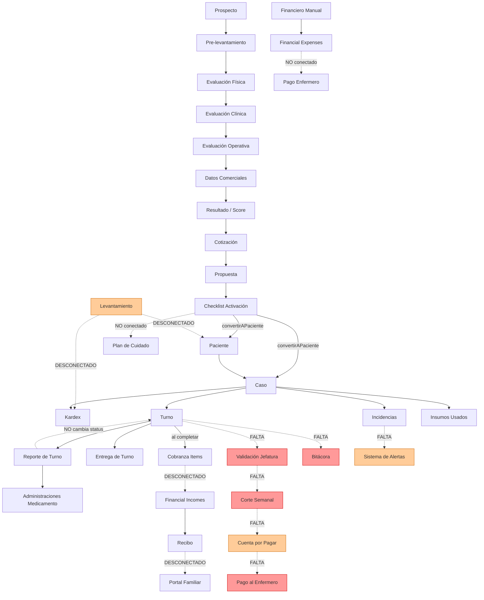

# Auditoría del Flujo Operativo — Abastemed

> **Fecha:** 2026-06-16  
> **Autor:** Auditoría técnica automatizada + revisión humana  
> **Versión:** 1.0

---

## 1. Inventario de Módulos

### 1.1 Prospectos y Evaluación Inicial

**Qué hace:** Registra solicitudes de servicio, realiza evaluación en cuatro dimensiones (prelevantamiento, física, clínica, operativa), calcula un score de riesgo, genera cotización automática, emite propuesta y convierte al prospecto en paciente activo.

**Tablas:** `prospects`, `patient_preassessments`, `physical_assessments`, `clinical_assessments`, `operational_risk_assessments`, `service_requests`, `assessment_results`, `care_quotes`, `quote_adjustments`, `generated_documents`, `activation_checklists`, `care_plans`

**Datos recibe:** Datos del solicitante, nombre del paciente, domicilio, diagnóstico, condición física y clínica, necesidades operativas, datos comerciales del servicio.

**Datos genera:** Score de complejidad (0-100+), nivel de riesgo (verde/amarillo/naranja/rojo), perfil recomendado de enfermero, precio calculado, propuesta formal en texto, checklist de activación.

**Roles:** admin (completo), jefe_enfermeros (puede ver prospectos, no puede convertir a paciente).

**Relación con otros módulos:** Al aceptar propuesta → crea `paciente` + `caso`. La cotización alimenta `care_plans` con instrucciones iniciales.

**Estado funcional:** ✅ Completo — Motor de score y precio funcional. Flujo de 13 páginas conectadas. Conversión a paciente implementada.

**Información duplicada:** Los datos del paciente se capturan tanto en `patient_preassessments` como en `pacientes` al convertir. La dirección del servicio aparece en `service_requests` y en `casos.direccion`.

**Partes incompletas:**
- La conversión a paciente crea el `caso` pero **no crea turnos recurrentes** basados en la frecuencia cotizada.
- El `care_plan` creado en la conversión **no se vincula automáticamente al módulo de Plan de Cuidado** (`indicaciones`).
- No hay seguimiento post-propuesta enviada (recordatorios, vencimiento automático).

**Funcionalidades desconectadas:** El levantamiento clínico (`levantamientos_paciente`) es paralelo e independiente a la evaluación de prospecto. Ambos capturan datos clínicos del paciente pero no se cruzan.

---

### 1.2 Levantamientos

**Qué hace:** Wizard de 10 pasos que captura información operativa detallada de un paciente antes de iniciar el servicio: datos personales, responsable, solicitud, valoración clínica, medicamentos, actividades de enfermería, materiales, entorno, plan y resumen.

**Tablas:** `levantamientos_paciente`, `levantamiento_medicamentos`, `levantamiento_materiales`

**Datos recibe:** Nombre del paciente, diagnóstico, responsable, condición clínica, medicamentos, materiales requeridos, entorno físico, costos estimados.

**Datos genera:** Ficha clínica-operativa, nivel de riesgo automático (bajo/medio/alto), costo estimado.

**Roles:** admin, jefe_enfermeros.

**Relación con otros módulos:** ⚠️ **DESCONECTADO** — El levantamiento existe como isla. No está vinculado a `prospectos`, `pacientes`, ni `casos`. El campo `paciente_nombre` es texto libre, no una FK.

**Estado funcional:** ✅ Completo como módulo aislado. ❌ No conectado al flujo principal.

**Información duplicada:** Duplica completamente la evaluación clínica del módulo de prospectos.

**Partes incompletas:**
- No tiene `paciente_id` FK → no se relaciona con pacientes existentes.
- El estado `convertido` existe pero no hay acción que lo ejecute.
- Los medicamentos del levantamiento no se exportan al kardex.
- Los materiales no se exportan al catálogo de insumos del caso.

---

### 1.3 Pacientes

**Qué hace:** CRUD de pacientes activos. Vista de expediente vivo con semáforo de estado, últimos signos vitales, kardex activo, incidencias recientes, accesos rápidos.

**Tablas:** `pacientes`

**Datos recibe:** Nombre, fecha nacimiento, diagnóstico, medicamentos (array de texto), alergias, contacto familiar, contexto (domicilio/hospital/casa_reposo).

**Datos genera:** Registro base para todos los módulos operativos.

**Roles:** admin (CRUD completo), jefe_enfermeros (solo lectura implementada parcialmente).

**Relación con otros módulos:** `casos` → `turnos` → `reportes_turno` → `incidencias`. `pacientes` es el nodo central.

**Estado funcional:** ✅ CRUD funcional. Expediente vivo con semáforo implementado.

**Información duplicada:** El campo `medicamentos` en `pacientes` (array de texto) duplica los datos del `kardex_medicamentos`. No están sincronizados.

**Partes incompletas:**
- `plan-cuidado` existe como módulo pero no se prepobla desde evaluaciones o levantamientos.
- No hay campo `responsable_pago_id` en `pacientes` — la responsabilidad de pago está en texto en `financial_incomes.responsable_pago_nombre`.

---

### 1.4 Familiares

**Qué hace:** Gestión de usuarios con rol `familiar`. Permite invitar familiares y vincularlos a un paciente. El familiar accede a un portal propio.

**Tablas:** `perfiles` (donde `rol = 'familiar'`)

**Datos recibe:** Email del familiar, nombre, relación con el paciente.

**Datos genera:** Usuario en `auth.users` + perfil con `paciente_id`.

**Roles:** admin (invitar, vincular). familiar (portal propio).

**Relación con otros módulos:** Familiar vinculado a `perfiles.paciente_id`. El portal familiar lee `turnos`, `entregas_turno`, `recibos`.

**Estado funcional:** ✅ Invitación y vinculación funcional. Portal familiar básico.

**Partes incompletas:**
- El portal familiar no muestra recibos de cobranza ni saldos actualizados.
- No existe vista de incidencias comunicables para el familiar.
- El familiar no puede registrar pagos desde el portal.

---

### 1.5 Enfermeros

**Qué hace:** CRUD de enfermeros. Registro con validación de admin. Portal propio del enfermero.

**Tablas:** `enfermeros`

**Datos recibe:** Nombre, cédula, especialidades, teléfono, email, bio, CV.

**Datos genera:** Registro de personal disponible para asignación de turnos.

**Roles:** admin (CRUD, aprobar). jefe_enfermeros (ver). enfermero (ver/editar propio perfil).

**Relación con otros módulos:** `turnos.enfermero_id` → `enfermeros`. `financial_expenses.enfermero_id` → `enfermeros`.

**Estado funcional:** ✅ CRUD funcional con aprobación.

**Partes incompletas:**
- No existe tabla de disponibilidad/horarios del enfermero.
- No hay vista de indicadores por enfermero (puntualidad, entregas, incidencias).
- No existe `tarifa_hora` por enfermero — la tarifa está en `casos.tarifa_hora` (tarifa de cobro, no de costo).

**Riesgo importante:** La tarifa del turno que se paga al enfermero es diferente a la tarifa que se cobra al familiar. Actualmente se usa la misma (`casos.tarifa_hora`). El módulo de cortes debe manejar una tarifa de costo diferente.

---

### 1.6 Casos

**Qué hace:** Agrupa turnos, indicaciones, kardex e incidencias bajo un servicio contratado para un paciente.

**Tablas:** `casos`

**Datos recibe:** Paciente, título, contexto, dirección, fecha inicio/fin, tarifa por hora, notas.

**Datos genera:** Contenedor operativo y financiero del servicio.

**Roles:** admin (CRUD), jefe_enfermeros (ver).

**Relación con otros módulos:** Es el nodo de integración: `turnos`, `kardex_medicamentos`, `incidencias`, `reportes_turno`, `financial_incomes`, `financial_expenses`, `cobranza_items`.

**Estado funcional:** ✅ CRUD funcional.

**Partes incompletas:**
- No hay `responsable_pago_id` FK a `perfiles`.
- No hay `tarifa_costo_hora` (costo del enfermero) vs `tarifa_hora` (cobro al cliente).
- No hay estado de activación o checklist de inicio.

---

### 1.7 Turnos

**Qué hace:** Asigna un enfermero a un caso en un horario específico. Controla inicio, fin y completado.

**Tablas:** `turnos`

**Datos recibe:** Caso, enfermero, fecha inicio, fecha fin.

**Datos genera:** Registro de trabajo. Al completar → `cobranza_items` automático.

**Roles:** admin, jefe_enfermeros (crear, cambiar status). enfermero (cambiar status propio).

**Relación con otros módulos:** `reportes_turno`, `entregas_turno`, `incidencias`, `cobranza_items`, `insumos_usados`.

**Estado funcional:** ✅ CRUD básico funcional.

**Partes incompletas y riesgos críticos:**
- **Estados insuficientes:** Solo 3 estados (`programado` | `activo` | `completado`). **Falta todo el flujo de validación:** `en_revision`, `validado`, `rechazado`, `en_aclaracion`.
- **No existe validación de jefatura.** Un turno `completado` entra directamente a cobranza sin revisión.
- **No existe conexión con nómina/pagos.** El módulo de cortes aún no existe.
- La cobranza se genera con `new Date(turno.fecha_inicio).toLocaleDateString('es-VE')` — localidad incorrecta (Venezuela en vez de México).
- `horas_trabajadas` no se calcula automáticamente; queda en 0 si no se edita.

---

### 1.8 Entregas de Turno

**Qué hace:** Registra la entrega formal entre enfermeros saliente y entrante, con signos vitales y medicamentos administrados.

**Tablas:** `entregas_turno`

**Datos recibe:** Turno saliente, turno entrante, enfermero saliente/entrante, signos vitales, medicamentos.

**Datos genera:** Continuidad del cuidado.

**Roles:** enfermero (crear desde portal), admin/jefe (ver).

**Estado funcional:** ✅ Funcional básico.

**Partes incompletas:**
- No hay estado de "turno sin entrega" que genere alerta.
- La entrega no retroalimenta el expediente del paciente automáticamente.

---

### 1.9 Reportes de Turno

**Qué hace:** Formulario clínico completo que el enfermero llena al terminar cada turno: signos vitales, alimentación, eliminación, medicamentos, cuidados de piel, observaciones.

**Tablas:** `reportes_turno`, `administraciones_medicamento`

**Datos recibe:** Turno, caso, signos vitales, estado general, dieta, medicamentos administrados, cuidados.

**Datos genera:** Expediente clínico del turno. Registros en `administraciones_medicamento`.

**Roles:** enfermero (crear). admin, jefe (ver).

**Estado funcional:** ✅ Formulario completo implementado.

**Partes incompletas:**
- El reporte **no cambia el estado del turno** a `completado` automáticamente.
- El reporte no actualiza indicadores clínicos del expediente (signos vitales fuera de rango).
- No hay validación de que exista reporte antes de cambiar turno a `completado`.

---

### 1.10 Kardex de Medicamentos

**Qué hace:** Registro permanente de medicamentos del paciente durante el episodio de cuidado, con trazabilidad de cada administración.

**Tablas:** `kardex_medicamentos`, `administraciones_medicamento`

**Datos recibe:** Nombre del medicamento, dosis, vía, frecuencia, horarios.

**Datos genera:** Control de medicación activa por caso.

**Roles:** admin, jefe_enfermeros (CRUD). enfermero (ver, registrar administración).

**Estado funcional:** ✅ Funcional con add/edit/suspend.

**Partes incompletas:**
- No conectado con levantamientos ni evaluaciones de prospecto.
- No genera alertas cuando un medicamento no tiene existencia.

---

### 1.11 Incidencias

**Qué hace:** Registro de eventos adversos con clasificación por gravedad.

**Tablas:** `incidencias`

**Datos recibe:** Tipo, descripción, signos vitales, intervención, gravedad, a quién se avisó.

**Datos genera:** Alerta de seguimiento. Historia de incidentes por caso.

**Roles:** admin, jefe_enfermeros, enfermero (crear). Familiar (no ve directamente).

**Estado funcional:** ✅ CRUD con semáforo de gravedad.

**Partes incompletas:**
- No hay sistema de alertas que notifique a jefatura cuando hay incidencia `grave` o `crítica`.
- No hay seguimiento de incidencias (estado, responsable asignado, resolución).
- No hay escalamiento automático.

---

### 1.12 Plan de Cuidado (Indicaciones)

**Qué hace:** Registro de indicaciones de enfermería con programación recurrente y control de eventos.

**Tablas:** `indicaciones`, `eventos_indicacion`

**Datos recibe:** Tipo de indicación, medicamento/actividad, dosis, vía, frecuencia, horarios.

**Datos genera:** Calendario de actividades de enfermería. Eventos programados.

**Roles:** admin, jefe_enfermeros (crear indicaciones). enfermero (ejecutar eventos).

**Estado funcional:** ✅ Funcional con agenda de cuidado.

**Partes incompletas:**
- No se prepobla desde evaluación de prospecto ni levantamiento.
- No se integra con el formulario de reporte de turno (no sugiere actividades pendientes).

---

### 1.13 Insumos

**Qué hace:** Catálogo de insumos y registro de uso por turno/caso.

**Tablas:** `insumos_catalogo`, `insumos_usados`

**Datos recibe:** Nombre, categoría, costo unitario, precio. Uso: caso, turno, enfermero, cantidad.

**Datos genera:** Costo de insumos por caso. Acumulado de consumo.

**Roles:** admin (CRUD catálogo, ver resúmenes). enfermero (registrar uso).

**Estado funcional:** ✅ Funcional básico.

**Partes incompletas:**
- Los costos de insumos **no se integran al cálculo de rentabilidad** por paciente/caso en finanzas.
- No hay distinción entre insumo absorbido por Abastemed vs cobrado al familiar.
- No hay inventario o stock disponible.

---

### 1.14 Cobranza

**Qué hace:** Lista de ítems de cobro generados automáticamente al completar turnos.

**Tablas:** `cobranza_items`

**Datos recibe:** Caso, turno, concepto, horas, tarifa, subtotal.

**Datos genera:** Lista de cobros pendientes/pagados.

**Roles:** admin.

**Estado funcional:** ⚠️ Parcialmente funcional.

**Partes incompletas / Riesgos:**
- `cobranza_items` **no está conectado con `financial_incomes`**. Son dos sistemas paralelos de cobranza.
- No hay generación automática de `financial_incomes` desde `cobranza_items`.
- La cobranza se genera al completar el turno, pero el turno **no requiere validación** antes de generarse.
- No hay vista de saldo por familiar/responsable de pago.
- Localidad `es-VE` (Venezuela) en vez de `es-MX` (México).

---

### 1.15 Finanzas

**Qué hace:** Control de ingresos (`financial_incomes`) y salidas (`financial_expenses`) con folios, balance por paciente/caso, dashboard financiero, CxC y CxP.

**Tablas:** `financial_incomes`, `financial_expenses`

**Datos recibe:** Manualmente: monto, tipo, beneficiario, paciente, caso, método de pago.

**Datos genera:** Balance financiero, utilidad estimada, cuentas por cobrar/pagar.

**Roles:** admin (CRUD completo).

**Estado funcional:** ✅ Módulo completo e independiente.

**Partes incompletas:**
- Las salidas de tipo `pago_enfermero` **no están conectadas con turnos específicos**. Es captura manual.
- No existe módulo de cortes/nómina que genere automáticamente las `financial_expenses`.
- El balance por caso incluye ingresos y gastos, pero **no incluye costo de insumos** (`insumos_usados`).
- No hay flujo de aprobación en pagos al personal (Dani valida → Mauricio autoriza).

---

### 1.16 Recibos

**Qué hace:** Generación de recibos de pago para familiares con ítems de cobro.

**Tablas:** `recibos`, `recibo_items`

**Datos recibe:** Nombre del paciente, conceptos, montos, método de pago, estado.

**Datos genera:** Recibo imprimible. Comprobante de pago.

**Roles:** admin (CRUD).

**Estado funcional:** ✅ Funcional con impresión.

**Partes incompletas:**
- Los recibos **no están vinculados a `financial_incomes` ni a `cobranza_items`**. Son documentos independientes.
- No hay relación con el caso o paciente por FK (solo texto).
- El familiar no puede ver sus recibos en el portal.

---

### 1.17 Bitácora

**Qué hace:** Historial de movimientos del sistema.

**Tablas:** ⚠️ **No existe tabla `bitacora_entries`** en ninguna migración. La ruta `/bitacora` existe pero puede estar leyendo de una tabla inexistente o vacía.

**Estado funcional:** ❌ **CRÍTICO** — La ruta existe pero la tabla de bitácora no fue creada en ninguna migración identificada.

---

### 1.18 Dashboard

**Qué hace:** Panel principal con métricas por rol (admin y jefe_enfermeros).

**Tablas:** Todas las tablas del sistema.

**Estado funcional:** ⚠️ Parcialmente funcional. Muestra métricas básicas pero no todos los indicadores están conectados a datos reales del sistema completo.

---

## 2. Mapa del Flujo Actual

---

## 3. Matriz de Integración

| Módulo origen | Evento | Módulo destino | Conexión actual | Conexión necesaria | Prioridad |
|---|---|---|---|---|---|
| Turno | Turno completado | Validación jefatura | ❌ No existe | Nuevo estado `en_revision` + vista de validación | **CRÍTICA** |
| Turno validado | Validación aprobada | Corte semanal | ❌ No existe | Incluir en `payroll_items` | **CRÍTICA** |
| Corte autorizado | Autorización admin | Cuenta por pagar | ❌ No existe | Generar `financial_expenses` automáticamente | **CRÍTICA** |
| Corte pagado | Pago registrado | Comprobante enfermero | ❌ No existe | Portal enfermero `mis-pagos` | **CRÍTICA** |
| Acción crítica | Cualquier mutación | Bitácora | ❌ Tabla no existe | Crear `bitacora_entries` + triggers | **CRÍTICA** |
| Incidencia grave | Creación | Sistema de alertas | ❌ No existe | Crear `alertas` + deduplicación | Alta |
| Prospecto aceptado | Activación | Plan de cuidado | ⚠️ Parcial | Pre-poblar `indicaciones` desde `care_plans` | Alta |
| Levantamiento | Aprobado | Paciente/Caso | ❌ Desconectado | Vincular `levantamiento_id` a `caso_id` | Alta |
| Reporte de turno | Creado | Estado del turno | ❌ No cambia status | Al crear reporte → turno pasa a `en_revision` | Alta |
| Cobranza item | Generado | Financial Income | ❌ Desconectado | Crear `financial_income` desde `cobranza_item` | Media |
| Recibo | Creado | Portal familiar | ❌ Desconectado | FK `caso_id` en recibos + vista familiar | Media |
| Insumos usados | Registrados | Balance caso | ⚠️ Parcial | Incluir `insumos_usados.costo` en `getBalanceCaso` | Media |
| Evaluación | Completada | Kardex inicial | ❌ No existe | Exportar medicamentos de evaluación a kardex | Media |
| Turnos | Datos reales | Dashboard indicadores | ⚠️ Parcial | Conectar contadores reales a dashboard | Media |
| Financial incomes | Registrados | Dashboard liquidez | ⚠️ Parcial | Módulo de liquidez y proyección | Conveniente |
| Signos vitales fuera rango | Reporte | Alerta automática | ❌ No existe | Detector de rangos + alerta | Conveniente |
| Propuesta sin respuesta | 7 días | Alerta seguimiento | ❌ No existe | Job scheduled o check en dashboard | Futura |

---

## 4. Riesgos Técnicos

### Riesgos CRÍTICOS

**RT-01: Tabla de bitácora inexistente**
- La ruta `/bitacora` existe pero no hay migración con una tabla `bitacora_entries`.
- La acción `getBitacoraGlobal` puede estar fallando silenciosamente.
- Impacto: Trazabilidad cero de acciones críticas.

**RT-02: Estados de turno insuficientes**
- Solo `programado` | `activo` | `completado`.
- No hay paso de validación entre `completado` y `pago`.
- Un turno puede generar `cobranza_items` sin haber sido revisado por jefatura.
- Impacto: Doble pago posible, pagos sin validación.

**RT-03: Cobranza y finanzas son sistemas paralelos sin conexión**
- `cobranza_items` y `financial_incomes` son independientes.
- Un cobro puede registrarse dos veces (uno en cobranza y otro manualmente en finanzas).
- Impacto: Datos financieros inconsistentes.

**RT-04: Pagos al personal son completamente manuales**
- `financial_expenses` de tipo `pago_enfermero` no tiene `turno_id`.
- No hay forma de saber qué turnos fueron pagados.
- Impacto: Riesgo de doble pago, sin trazabilidad de nómina.

**RT-05: Localidad incorrecta en formato de fecha**
- `new Date().toLocaleDateString('es-VE')` en `turnos.ts` → formato venezolano.
- El proyecto debe usar `es-MX`.

### Riesgos ALTOS

**RT-06: Levantamientos sin FK a pacientes**
- `levantamientos_paciente.paciente_nombre` es texto libre.
- No hay integridad referencial con `pacientes`.
- Impacto: Registros huérfanos, información desconectada.

**RT-07: `horas_trabajadas` no se calcula al completar turno**
- El campo se establece en `0` por defecto.
- La cobranza usa una fórmula fallback `(fecha_fin - fecha_inicio) / 3600000`.
- Impacto: Inconsistencias entre `horas_trabajadas` y la facturación real.

**RT-08: Reporte de turno no valida turno**
- El turno puede marcarse como `completado` sin reporte.
- Impacto: Pagos sin evidencia de atención.

**RT-09: Tarifa de cobro vs tarifa de costo**
- `casos.tarifa_hora` es la tarifa de cobro al cliente.
- No existe `tarifa_costo_hora` para el pago al enfermero.
- Impacto: La rentabilidad no puede calcularse correctamente.

**RT-10: Medicamentos duplicados entre módulos**
- `pacientes.medicamentos` (array texto) vs `kardex_medicamentos` (tabla estructurada).
- No están sincronizados.
- Impacto: Enfermero puede ver medicamentos desactualizados.

### Riesgos MEDIOS

**RT-11: RLS para jefe_enfermeros no validada**
- El código usa `requireRole(perfil, 'admin', 'jefe_enfermeros')` pero las políticas RLS de algunas tablas solo permiten `admin`.
- Impacto: Las acciones pasan la validación en código pero pueden fallar en BD.

**RT-12: Recibos sin FK**
- `recibos.paciente_nombre` es texto libre.
- No hay `paciente_id` ni `caso_id` con FK.
- Impacto: Los recibos no se pueden mostrar en el portal familiar.

**RT-13: Care plans sin conexión a indicaciones**
- `care_plans` (prospectos) existe separado de `indicaciones` (plan de cuidado).
- No hay migración de uno al otro al activar paciente.

**RT-14: Acciones silenciosas en caso de error de BD**
- En varios `catch` se devuelve `[]` en vez de propagar el error.
- Impacto: Pantallas vacías sin mensaje de error al usuario.

**RT-15: Índices faltantes en tablas de alta consulta**
- `reportes_turno`, `incidencias`, `administraciones_medicamento` pueden no tener índices en `caso_id`, `turno_id`.

---

## 5. Plan de Integración

### Críticas (implementar ahora)

| # | Tarea | Descripción |
|---|---|---|
| C-01 | Ampliar estados de turno | Agregar `en_revision` \| `validado` \| `rechazado` \| `en_aclaracion` a `StatusTurno` |
| C-02 | Crear tabla `payroll_periods` | Periodos de corte semanal de nómina |
| C-03 | Crear tabla `payroll_items` | Partidas individuales por enfermero/turno |
| C-04 | Crear tabla `bitacora_entries` | Trazabilidad de todas las acciones críticas |
| C-05 | Crear tabla `alertas` | Sistema de alertas internas con deduplicación |
| C-06 | Flujo de validación jefatura | Vista `/turnos/validacion` + acciones validar/rechazar/aclarar |
| C-07 | Módulo de cortes | CRUD de periodos + generación de partidas + autorización |
| C-08 | Integración payroll → finanzas | Al autorizar corte → crear `financial_expenses` por enfermero |
| C-09 | Portal pagos del enfermero | `/enfermero/mis-pagos` con estados y comprobantes |
| C-10 | Corregir localidad `es-MX` | Fechas en formato mexicano en todo el sistema |

### Importantes

| # | Tarea | Descripción |
|---|---|---|
| I-01 | Agregar `tarifa_costo_hora` a casos | Separar tarifa de cobro vs costo de personal |
| I-02 | Calcular `horas_trabajadas` al completar | Auto-calcular desde `fecha_inicio` y `fecha_fin` |
| I-03 | Validar reporte antes de completar turno | Advertencia o bloqueo si no hay reporte |
| I-04 | Conectar insumos a balance financiero | Incluir `insumos_usados` en `getBalanceCaso` |
| I-05 | Agregar `paciente_id` FK a levantamientos | Vincular levantamientos a pacientes existentes |
| I-06 | Salud del sistema | Pantalla `/salud-sistema` con chequeos de integridad |
| I-07 | Dashboard indicadores reales | Conectar contadores del dashboard a datos reales |

### Convenientes

| # | Tarea | Descripción |
|---|---|---|
| V-01 | Exportar medicamentos levantamiento a kardex | Al aprobar levantamiento → pre-poblar kardex |
| V-02 | Pre-poblar plan de cuidado desde activación | `care_plans` → `indicaciones` al convertir prospecto |
| V-03 | Alertas de incidencias graves | Al crear incidencia `grave`/`crítica` → crear alerta |
| V-04 | FK en recibos | Agregar `caso_id` a `recibos` + mostrar en portal familiar |
| V-05 | Dashboard de liquidez | Proyección de flujo 7 y 30 días |

### Futuras

| # | Tarea | Descripción |
|---|---|---|
| F-01 | Notificaciones externas | WhatsApp/email al familiar al registrar incidencia grave |
| F-02 | Exportación PDF/Excel | Cortes, reportes, recibos en PDF |
| F-03 | Vencimiento automático de propuestas | Job que cambia status a `vencida` después de N días |
| F-04 | Inventario de insumos | Control de stock disponible |
| F-05 | Disponibilidad de enfermeros | Calendario de disponibilidad para asignación |

---

*Generado el 2026-06-16. Próxima revisión recomendada al implementar la Fase 3 completa.*
