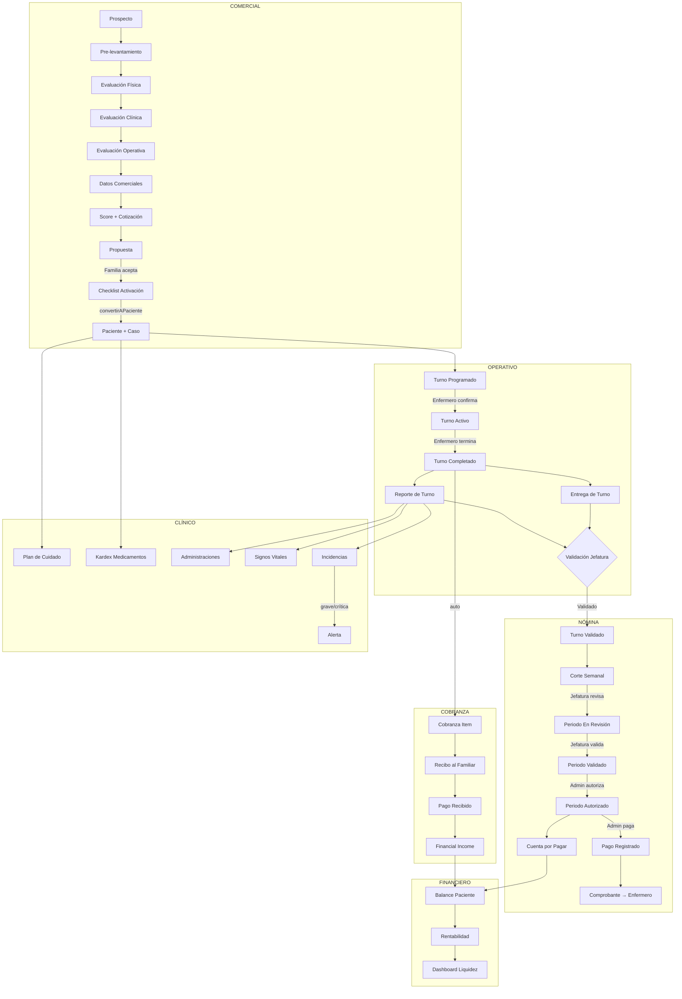

# Flujo Operativo Integral — Abastemed

> **Versión:** 1.0 — 2026-06-16

---

## Diagrama Completo del Sistema



---

## Descripción de Cada Etapa

### 1. Prospecto
**Responsable:** Admin / Comercial  
**Acción:** Registrar solicitud de servicio con datos del solicitante y paciente.  
**Resultado:** Registro en `prospects` con status `nuevo`.

### 2. Evaluación
**Responsable:** Admin  
**Flujo:** Pre-levantamiento → Evaluación Física → Evaluación Clínica → Evaluación Operativa → Datos Comerciales  
**Resultado:** Score de complejidad (0–100+), nivel de riesgo (verde/amarillo/naranja/rojo), perfil recomendado de enfermero.

### 3. Cotización
**Responsable:** Admin  
**Acción:** El sistema calcula el precio basado en el score. El admin puede ajustar el precio final.  
**Resultado:** `care_quotes` con precio sugerido y precio final autorizado.

### 4. Propuesta
**Responsable:** Admin  
**Acción:** Generar documento de propuesta (WhatsApp corto / propuesta formal) y enviarlo a la familia.  
**Estados de propuesta:** `enviada` → `aceptada` / `rechazada`

### 5. Activación del Paciente
**Responsable:** Admin  
**Acción:** Completar checklist de activación (15 ítems). Al marcar `listo_para_activar`, ejecutar `convertirAPaciente()`.  
**Resultado:** Crea `paciente` + `caso` + `care_plan`. El prospecto pasa a `paciente_activo`.

### 6. Configuración del Caso
**Responsable:** Admin / Jefe Enfermería  
**Acción:** Completar datos del caso: dirección, `tarifa_hora` (cobro), `tarifa_costo_hora` (pago al enfermero), horarios.  
**Resultado:** Caso en estado `activo` listo para asignación de turnos.

### 7. Plan de Cuidado
**Responsable:** Jefe Enfermería  
**Acción:** Crear indicaciones médicas con frecuencia, dosis y horarios. Llenar kardex de medicamentos.  
**Resultado:** Agenda de cuidado generada. Eventos programados automáticamente.

### 8. Programación de Turno
**Responsable:** Admin / Jefe Enfermería  
**Acción:** Crear turno asignando enfermero, fecha inicio y fecha fin.  
**Regla:** Verificar disponibilidad del enfermero antes de asignar.  
**Resultado:** Turno en estado `programado`. Alerta si no hay enfermero disponible.

### 9. Ejecución del Turno
**Responsable:** Enfermero  
**Estados:** `programado` → `activo` → `completado`  
**Acciones del enfermero:**
- Confirmar turno (acepta la asignación)
- Iniciar turno (marca `activo` al llegar)
- Registrar atención durante el turno
- Terminar turno (marca `completado`)

### 10. Reporte de Turno
**Responsable:** Enfermero  
**Acción:** Llenar formulario clínico completo:
- Signos vitales
- Estado general del paciente
- Alimentación e hidratación
- Eliminación
- Medicamentos administrados (vinculados al kardex)
- Cuidados de piel y movilización
- Observaciones y pendientes

**Resultado:** `reportes_turno` + `administraciones_medicamento`. Turno listo para revisión.

### 11. Entrega de Turno
**Responsable:** Enfermero saliente → Enfermero entrante  
**Acción:** Registrar entrega formal con signos vitales, medicamentos y observaciones.  
**Resultado:** `entregas_turno`. Continuidad garantizada del cuidado.

### 12. Validación de Jefatura
**Responsable:** Jefe de Enfermería (Dani)  
**Ruta:** `/turnos/validacion` → `/turnos/[id]/validar`  
**Proceso:**
1. Revisar reporte clínico
2. Verificar entrega de turno
3. Confirmar horas pagables (pueden diferir de horas reales por incidencias)
4. Tomar decisión:

| Acción | Estado resultante | Descripción |
|---|---|---|
| Validar | `validado` | Turno elegible para pago |
| Enviar a aclaración | `en_aclaracion` | Requiere respuesta del enfermero |
| Rechazar | `rechazado` | No aplica para pago (con motivo) |

**Regla de negocio:** La jefatura NO puede ejecutar pagos ni modificar importes financieros finales.

### 13. Generación del Corte
**Responsable:** Admin o Jefe Enfermería  
**Ruta:** `/cortes/nuevo` → `/cortes/[id]`  
**Proceso:**
1. Crear periodo (fecha inicio / fecha fin)
2. Ejecutar "Generar partidas" → el sistema obtiene todos los turnos `validado` en el rango
3. Calcula: horas pagables × tarifa_costo_hora por turno
4. Agrupa por enfermero
5. Permite revisar y ajustar partidas individuales

**Protección:** Un mismo turno NO puede aparecer en dos cortes activos simultáneamente (restricción UNIQUE en BD).

### 14. Revisión y Validación del Corte
**Responsable:** Jefe Enfermería → Admin  
**Estados del periodo:**

```
borrador → en_revision → validado → autorizado → pagado → cerrado
```

- **Borrador:** Se puede recalcular libremente
- **En revisión:** Jefatura está revisando partidas individuales
- **Validado:** Jefatura confirmó todo. Admin puede autorizar.

### 15. Autorización y Pago (Admin — Mauricio)
**Responsable:** Admin únicamente  
**Ruta:** `/cortes/[id]` → botón "Autorizar corte"  
**Proceso:**
1. Autorizar el corte → se generan automáticamente `financial_expenses` por enfermero
2. Registrar pago → método, referencia, comprobante
3. Sistema actualiza: items → `pagado`, expenses → `pagado`, periodo → `pagado`

**Regla:** Solo el rol `admin` puede ejecutar esta acción. La jefatura no tiene acceso.

### 16. Portal del Enfermero — Mis Pagos
**Responsable:** Enfermero  
**Ruta:** `/enfermero/mis-pagos`  
**Ve:** Historial de periodos, turnos considerados, horas, tarifa, total, estado, comprobante.  
**NO ve:** Pagos de otros enfermeros, tarifas de cobro al cliente, rentabilidad.

### 17. Cobranza al Familiar
**Responsable:** Admin  
**Flujo:**
- Turno completado → `cobranza_items` generado automáticamente
- Admin crea recibo → `recibos` + `recibo_items`
- Familia paga → `financial_incomes` con referencia

**Portal familiar:** Ve recibos, saldos y método de contacto. No ve pagos al personal ni rentabilidad.

---

## Estados del Sistema

### StatusTurno
| Estado | Descripción |
|---|---|
| `programado` | Turno creado, pendiente de confirmación |
| `activo` | Enfermero inició el turno |
| `completado` | Enfermero terminó el turno |

### ValidacionStatusTurno
| Estado | Descripción | Responsable |
|---|---|---|
| `pendiente` | Turno completado, sin revisar | — |
| `en_revision` | Jefatura está revisando | Jefe Enfermería |
| `validado` | Aprobado para pago | Jefe Enfermería |
| `rechazado` | No aplica para pago | Jefe Enfermería |
| `en_aclaracion` | Requiere aclaración | Enfermero |

### EstadoPayrollPeriod
| Estado | Descripción | Responsable |
|---|---|---|
| `borrador` | En construcción, editable | Admin / Jefe |
| `en_revision` | Jefatura revisando partidas | Jefe Enfermería |
| `validado` | Jefatura confirmó todo | Jefe Enfermería |
| `autorizado` | Admin autorizó el pago | Admin |
| `parcialmente_pagado` | Algunos pagos realizados | Admin |
| `pagado` | Todos los pagos realizados | Admin |
| `cerrado` | Periodo archivado | Admin |
| `cancelado` | Cancelado con motivo | Admin |

---

## Automatizaciones Implementadas

| Trigger | Acción automática |
|---|---|
| Turno marcado `completado` | Calcula `horas_trabajadas`, genera `cobranza_items`, crea alerta de validación |
| Turno `validado` por jefatura | Registra en bitácora, turno elegible para corte |
| Periodo `autorizado` | Genera `financial_expenses` por enfermero, marca items `autorizado` |
| Periodo `pagado` | Actualiza items, actualiza `financial_expenses`, registra comprobante |
| Incidencia `en_aclaracion` | Crea `alerta` tipo `turno_en_aclaracion` |
| Insert/Update en `payroll_items` | Trigger SQL recalcula totales del periodo automáticamente |

---

## Reglas Financieras

1. **Tarifa de cobro ≠ Tarifa de costo:** `casos.tarifa_hora` es lo que paga la familia. `casos.tarifa_costo_hora` es lo que se paga al enfermero. Si no se define `tarifa_costo_hora`, el sistema usa 60% de `tarifa_hora` como estimado.

2. **No hay pago sin validación:** Un turno no puede estar en un corte sin haber pasado por `validacion_status = 'validado'`.

3. **No hay doble pago:** La restricción UNIQUE en `payroll_items(turno_id)` impide que el mismo turno aparezca en dos cortes activos.

4. **Las salidas de nómina se generan automáticamente:** Al autorizar un corte, el sistema crea las `financial_expenses` correspondientes. No se deben crear manualmente si ya existe un corte.

5. **Los ingresos y salidas son independientes de la liquidez:** Abastemed puede pagar al enfermero aunque la familia aún no haya pagado. El dashboard de liquidez muestra la diferencia.

---

## Reglas Clínicas

1. **No se valida un turno sin reporte:** El sistema advierte si se intenta validar un turno sin reporte clínico.
2. **Las incidencias graves generan alertas:** Los tipos `grave` y `crítica` crean alertas en el sistema para seguimiento.
3. **El kardex controla medicamentos activos:** Los medicamentos del kardex son la fuente de verdad para administración. No se usa `pacientes.medicamentos` para operación.
4. **Los signos vitales quedan en el reporte:** No se sobreescriben. Cada reporte tiene sus propios signos vitales para historial longitudinal.

---

## Alertas del Sistema

| Tipo | Gravedad | Responsable | Cuándo |
|---|---|---|---|
| `turno_sin_enfermero` | Crítica | Admin | Turno sin enfermero asignado |
| `incidencia_critica` | Crítica | Jefe Enfermería | Incidencia tipo `crítica` creada |
| `incidencia_grave` | Alta | Jefe Enfermería | Incidencia tipo `grave` creada |
| `turno_sin_reporte` | Media | Jefe Enfermería | Turno completado sin reporte |
| `turno_en_aclaracion` | Alta | Admin | Turno enviado a aclaración |
| `cuenta_por_cobrar_vencida` | Alta | Admin | Ingreso vencido sin pago |
| `corte_sin_autorizar` | Media | Admin | Periodo validado sin autorizar |

---

## Permisos por Rol

### Admin
- Acceso completo a todos los módulos
- Único que puede: autorizar pagos, ejecutar pagos, ver rentabilidad global, acceder a Salud del Sistema

### Jefe de Enfermería
- Puede: validar turnos, revisar cortes, gestionar incidencias, ver plan de cuidado, acceder a `/turnos/validacion` y `/cortes`
- No puede: autorizar pagos, ejecutar pagos, ver rentabilidad, ver comprobantes bancarios completos, ver datos financieros de otros enfermeros

### Enfermero
- Solo ve sus propios turnos, reportes y pagos
- Puede: confirmar/iniciar/terminar turnos propios, registrar reportes, solicitar insumos
- No puede: ver turnos de otros, ver pagos de otros, acceder a finanzas

### Familiar
- Solo ve información de su paciente autorizado
- Puede: ver recibos, saldos, reportes (versión resumida), incidencias comunicables
- No puede: ver pagos al personal, ver rentabilidad, ver información de otros pacientes
